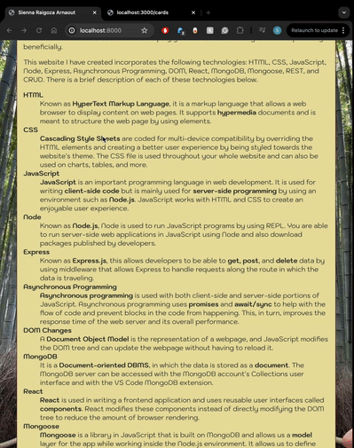
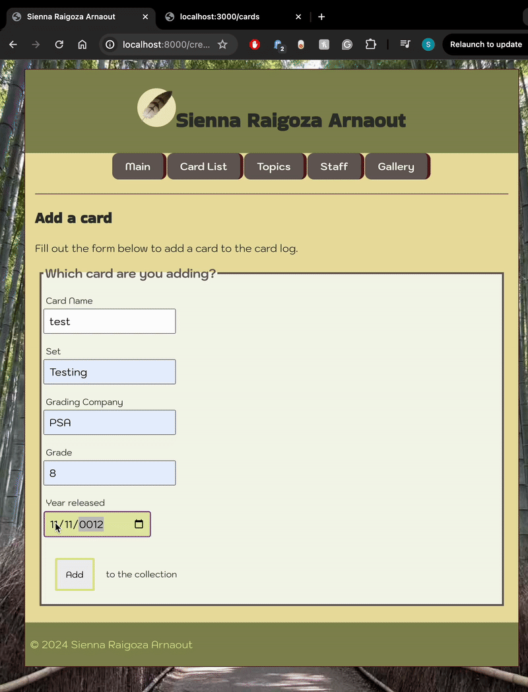

# MERN Website Showcase 🌐

This is a full-stack web application built with the MERN stack (MongoDB, Express, React, Node.js). The site features dynamic pages, CRUD functionality, and a responsive user interface.

🔐 Code is not publicly available — this repository showcases the design, features, and architecture.

---

 

 

 

## 🔧 Features
- Full Create, Read, Update, Delete (CRUD) functionality
- Responsive UI built with React
- RESTful API using Express and MongoDB
- Real-time data updates and form validation
- Styled with CSS

## 💻 Technologies Used
- MongoDB
- Express.js
- React.js
- Node.js
- JavaScript
- REST API
- Mongoose

## 📌 Notes
🔒 Codebase is private.  
📫 Contact me if you'd like to discuss this project further or see a live demo!

---

© 2025 Sienna R.
